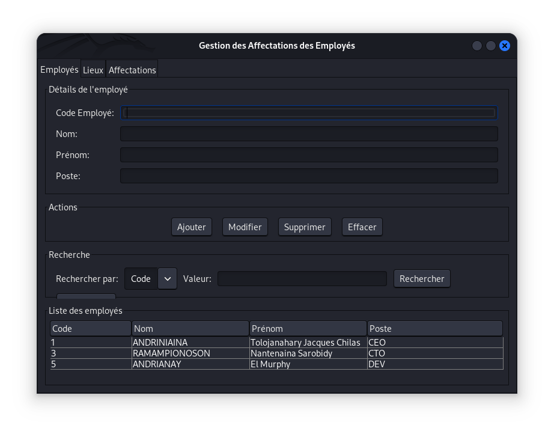
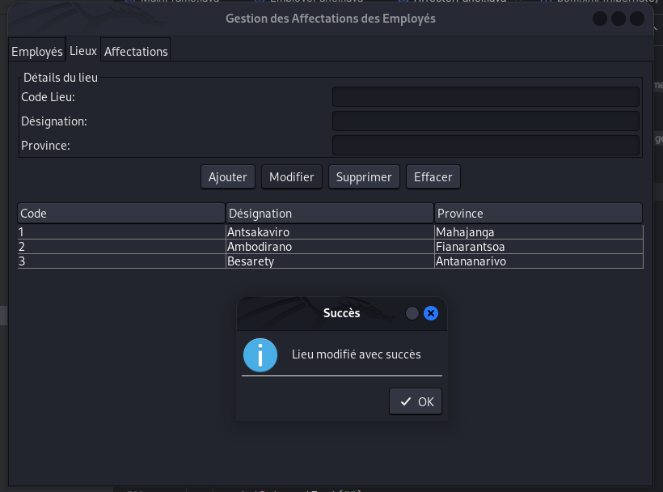
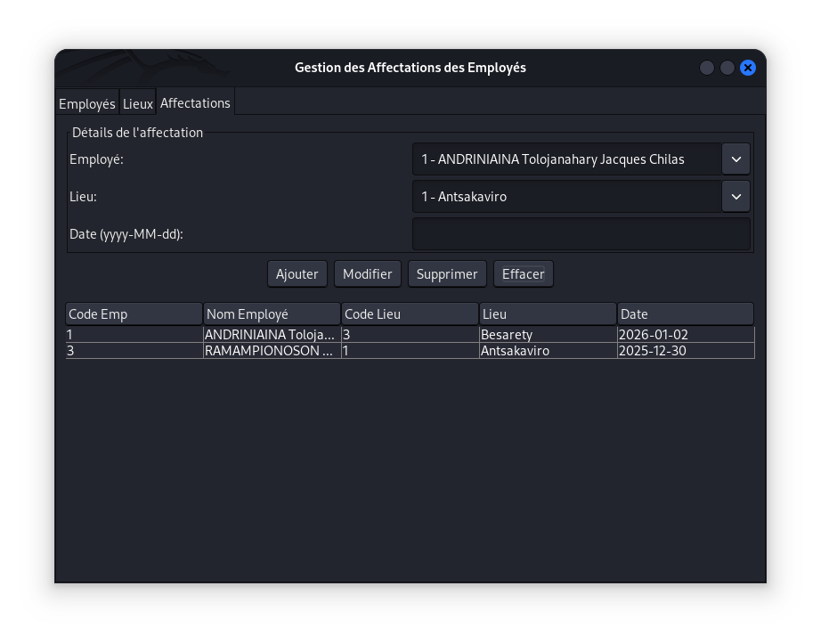

# Employee Assignment Management System

[](LICENSE)
[](https://www.java.com)
[](https://hibernate.org/)
[](https://www.mysql.com/)
[](https://docs.oracle.com/javase/tutorial/uiswing/)

## 📋 Overview

The Employee Assignment Management System is a desktop application built with Java Swing that provides a comprehensive solution for managing employee assignments across different locations. This application uses Hibernate ORM to interact with a MySQL database, showcasing the integration of Java desktop UI with modern data persistence techniques.



## 🔑 Key Features

- **Complete Employee Management**: Add, update, delete, and search employees by their ID or name
- **Location Management**: Maintain a database of all available work locations with province information
- **Assignment Tracking**: Assign employees to various locations with date tracking
- **User-Friendly Interface**: Intuitive tabbed interface for easy navigation between entities
- **Data Validation**: Comprehensive validation for all inputs including date format validation
- **Real-time Data Refresh**: Automatic data refresh when switching between different tabs

## 💻 Technical Stack

- **Frontend**: Java Swing for desktop UI components
- **Backend**: Java with Hibernate ORM for data persistence
- **Database**: MySQL relational database
- **Architecture**: DAO (Data Access Object) pattern for clean separation of concerns
- **Data Model**: Well-defined entity relationships with proper foreign key constraints

## 🏗️ Project Structure

The application follows a standard 3-tier architecture:

```
org.schoolproject
├── dao              # Data Access Objects for database operations
│   ├── EmployeDAO.java
│   ├── LieuDAO.java
│   └── AffecterDAO.java
├── model            # Entity models mapped to database tables
│   ├── Employe.java
│   ├── Lieu.java
│   ├── Affecter.java
│   └── AffecterPK.java
├── ui               # User interface components
    ├── MainApp.java # Entrypoint
│   ├── MainFrame.java
│   ├── EmployePanel.java
│   ├── LieuPanel.java
│   └── AffecterPanel.java
└── util             # Utility classes
    └── HibernateUtil.java
```

## 🗃️ Data Models

### Employees (EMPLOYE)
- `codeemp`: Unique employee identifier
- `nom`: Last name
- `prenom`: First name
- `poste`: Job position

### Locations (LIEU)
- `codelieu`: Unique location identifier
- `designation`: Location name
- `province`: Province where the location is situated

### Assignments (AFFECTER)
- `codeemp`: Employee ID (Foreign key)
- `codelieu`: Location ID (Foreign key)
- `date`: Assignment date

## 🚀 Installation and Setup

1. **Prerequisites**:
   - Java JDK 17 or higher
   - MySQL 8.0 or higher
   - Maven (for dependency management)


2. **Configure Hibernate**:
   - Update `hibernate.cfg.xml` with your database credentials

3. **Run the Application**:
   ```bash
   mvn clean package
   java -jar target/hibernate-1.0-SNAPSHOT-jar-with-dependencies.jar 
   ```

## 🖥️ Usage

1. **Managing Employees**:
   - Navigate to the "Employés" tab
   - Fill in employee details and click "Ajouter" to add a new employee
   - Select an employee from the table to update or delete

2. **Managing Locations**:
   - Switch to the "Lieux" tab
   - Add new locations with designation and province
   - Modify existing locations as needed

3. **Managing Assignments**:
   - Go to the "Affectations" tab
   - Select an employee and location from the dropdown menus
   - Specify the assignment date in YYYY-MM-DD format
   - Use the buttons to add, modify, or delete assignments

## 🛠️ Implementation Details

### Validation Features
- Date format validation (YYYY-MM-DD)
- Leap year checking for February dates
- Duplicate assignment prevention
- Required field validation

### Data Access Layer
- Hibernate ORM for object-relational mapping
- Transaction management for data consistency
- Composite key handling for the assignment entity

### User Interface
- Well-organized tabbed interface
- Responsive table views with selection listeners
- Intuitive form layouts for data entry

## 🤝 Contributing

Contributions are welcome! Please feel free to submit a Pull Request.

1. Fork the repository
2. Create your feature branch (`git checkout -b feature/amazing-feature`)
3. Commit your changes (`git commit -m 'Add some amazing feature'`)
4. Push to the branch (`git push origin feature/amazing-feature`)
5. Open a Pull Request

## 📝 License

This project is licensed under the MIT License - see the LICENSE file for details.

## 🙏 Acknowledgments

- Special thanks to all contributors and testers
- Inspired by real-world employee management systems
- Developed as part of a school project on Java desktop applications with Hibernate

  
